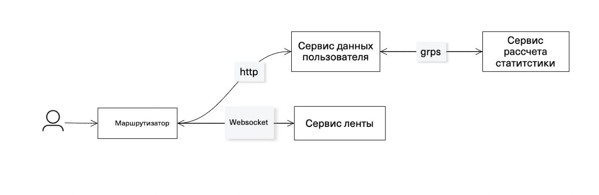
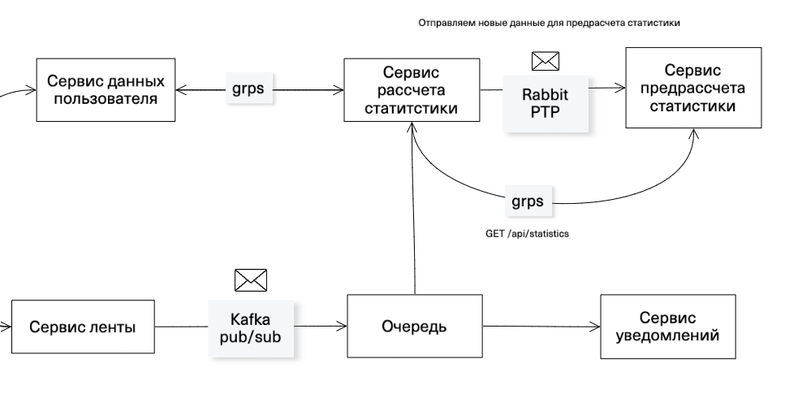
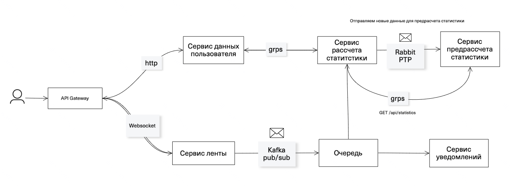

# Проектирование взаимодействия микросервисов с использованием современных сетевых технологий и систем сообщений

## Цель
Вам нужно спроектировать взаимодействие между микросервисами в распределённой системе с использованием различных сетевых 
протоколов, API Gateway и системы сообщений. Задача заключается в создании архитектуры, 
которая обеспечивает высокую производительность, масштабируемость, надёжность и гибкость.


## Выбор сетевых протоколов и их интеграция



1. Для сервисов типа запрос-ответ (на схеме - сервис данных пользователя) используем протокол HTTP/2. Наиболее популярный 
протокол клиент-серверного взаимодействия. Клиент инициирует запрос данных к серверу, коннект завершается после того 
как сервер ответил на запрос. Подходит для CRUD-операций, которые не требуют большой производительности.  

2. gRpc используем для эффективного взаимодействия между сервисами (на схеме - сервис расчета статистики на лету). 
Он позволяет обеспечить высокую производительность, при этом коннект поддерживается на протяжениии времени, 
в течении которого между клиентом и сервером передаются данные. gRpc использует HTTP/2 и буферы протоколов для сериализации сообщений, 
это обеспечивает более быструю эффективную связь. 

3. Websocket позволяет поддерживать постоянное соединение между клиентом и сервером. Поэтому его используем 
для отображении ленты новостей, которая постоянно обновляется. (на схеме - сервис ленты (новостей)). 
Данные по нему передаются в обоих направлениях, без разрыва соединения и дополнительных HTTP-запросов.

Для улучшения коннекта до сервиса данных пользователя перейдем от использования HTTP/2 на HTTP/3. 
В HTTP/3 используется QUIC вместо TCP. Это позволит сократить задержки при первом подключении, также HTTP/3 поддерживает 0-RTT, 
что позволяет клиенту начинать передачу данных сразу же после установления соединения, 
без необходимости ожидания подтверждения сервера. Это особенно полезно для повторных подключений. 
QUIC поддерживает мултилексию потоков на уровне протокола, что позволяет потокам работать параллельно без блокировки
друг друга. Это удучшает производительность при передаче нескольких запросов одновременно.
Также HTTP/3 использует TLS 1.3, который обеспечивает более быструю и безопасную установку соединения по сравнению с TLS 1.2, 
используемым в HTTP/2.

## Проектирование и реализация API
### 1. Опишем спецификацию одного из сервисов - сервис новостной ленты, который работает через WebSocket

[OpenAPI для сервиса ленты новостей](feed-openapi.yaml)

### 2. Сконфигурируем Service Discovery для микросервисов через k8s.
Создадим манифесты для трех микросервисов: user-service, statistics-service и news-feed-service.

#### 1.  Создадим манифест для user-service. 

[user-service-deployment.yaml](service-discovery/user-service-deployment.yaml)

[user-service-service.yaml](service-discovery/user-service-service.yaml)
#### 2.  Создадим манифест для statistics-service. 

[statistics-service-deployment.yaml](service-discovery/statistics-service-deployment.yaml)

[statistics-service-service.yaml](service-discovery/statistics-service-service.yaml)
#### 3.  Создадим манифест для news-feed-service. 

[news-feed-service-deployment.yaml](service-discovery/news-feed-service-deployment.yaml)

[news-feed-service-service.yaml](service-discovery/news-feed-service-service.yaml)

#### 4.  Применим манифесты.
   ```
   kubectl apply -f user-service-deployment.yaml
   kubectl apply -f user-service-service.yaml
   kubectl apply -f statistics-service-deployment.yaml
   kubectl apply -f statistics-service-service.yaml
   kubectl apply -f news-feed-service-deployment.yaml
   kubectl apply -f news-feed-service-service.yaml
   ```

Kubernetes автоматически создает записи DNS для каждого сервиса. 
Например, для user-service будет доступен DNS-имя user-service.default.svc.cluster.local, 
где default — это пространство имен, а svc.cluster.local — суффикс для сервисов в Kubernetes.

Можно использовать DNS-имя сервиса для обнаружения его адреса.
Опишем пример обращения к сервису statistics-service из сервиса user-service.
[UserService.java](service-discovery/UserService.java)

С использованием Kubernetes можно настроить обнаружение сервисов без необходимости дополнительных инструментов, таких как Consul.

### 3. Создадим манифест для API Gateway.
Настройка API Gateway для управления микросервисами в Kubernetes выполним с помощью NGINX Ingress Controller.
Установим NGINX Ingress в k8s. Для аутентификации пользователей будем использовать OAuth2 Proxy.

Создадим манифест для NGINX Ingress Controller с настройками OAuth2 Proxy и Rate Limiting.

```aiignore

apiVersion: v1
kind: ConfigMap
metadata:
  name: nginx-config
  namespace: ingress-nginx
data:
  enable-rate-limiting: "true"
  rate-limiting-service: "rate-limiting-service:6379"
  rate-limiting-policy: "user=10r/s"
  
```

Создадим файл ingress.yml с настройками OAuth2 Proxy

[ingress.yml](service-discovery/ingress.yml)


## 3. Использование систем сообщений

В качестве брокера сообщений для PTP выберем RabbitMQ, а для Pub/Sub - Kafka.
Доработаем схему, добавим взаимодействия между сервисами через систему сообщений.




Для обеспечения надежности доставки сообщений в Kafka можно использовать следующие настройки:

acks=all: Убедиться, что все реплики подтверждают получение сообщения.
retries=MAX_INT: Позволяет автоматически повторять отправку сообщений в случае сбоев.
enable.idempotence=true: Предотвращает дублирование сообщений при повторных отправках

## 4. Интеграция компонентов
### Архитектурная диаграмма



### Обработка сбоев

Отказ микросервиса: В случае выхода из строя одной из нод микросервиса нагрузка распределяется между остальными нодами.

Отказ системы сообщений: Для предотвращения потери сообщений при отказе Kafka можно использовать репликацию топиков. 

## 5. Мониторинг и отладка

Метрики для мониторинга системы 
 - Лаг в системе сообщений
 - Время жизни сообщений в системе (есть слишком старые)
 - Количество ошибок вызовов методов 
 - Время ответа
 - 

Для анализа состояния взаимодействий и системы сообщений будем использовать Prometheus и Grafana.


